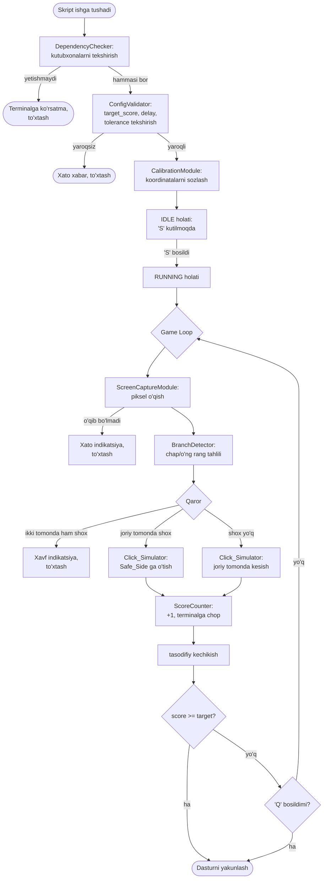

# Dizayn Hujjati

## Overview

`lumberjack-bot` — Telegram "Lumberjack" o'yinini operatsion tizim va apparat darajasida o'ynaydigan Python skriptidir. Brauzer xavfsizlik cheklovlari (CORS/iframe) sababli bot brauzer kodiga tegmaydi; uning o'rniga ekran piksellarini suratga oladi, daraxt tanasining chap va o'ng nuqtalaridagi ranglarni tahlil qilib shoxlarni aniqlaydi, qahramonni xavfsiz tomonga o'tkazish uchun sichqoncha bosishini simulyatsiya qiladi, kesishlarni sanaydi va belgilangan maqsadli ballga (`target_score`) yetganda avtomatik to'xtaydi.

Bu dizayn quyidagi asosiy oqimlarni qamrab oladi:

- **Bog'liqliklarni tekshirish** — ishga tushishdan oldin kerakli kutubxonalar mavjudligini tasdiqlash (Requirement 1).
- **Kalibrlash rejimi** — Canvas koordinatalarini interaktiv sozlash (Requirement 4).
- **Asosiy o'yin tsikli** — piksel o'qish, shox aniqlash, bosish, sanash (Requirement 2, 3).
- **Inson-simon ritm** — kesishlar orasida tasodifiy kechikish (Requirement 5).
- **Klaviatura boshqaruvi** — 'S' boshlash / 'Q' to'xtatish holat mashinasi (Requirement 6).
- **Hujjatlashtirish** — izohlangan kod va ishga tushirish yo'riqnomasi (Requirement 7).

Loyiha bitta ishga tushiriladigan Python skripti sifatida yetkaziladi, ammo ichki jihatdan mas'uliyatlarga ko'ra alohida modullarga (komponentlarga) ajratiladi. Bu ajratish testlash imkonini beradi, ayniqsa sof mantiqiy qismlar (shox aniqlash qarori, ball sanash, kechikish va koordinata validatsiyasi) apparatdan mustaqil ravishda sinovdan o'tkazilishi mumkin.

## Architecture

Tizim "captur → tahlil → qaror → harakat" (sense-decide-act) tsikliga asoslangan. Apparat bilan ishlovchi kirish/chiqish (I/O) qatlami sof mantiqiy qatlamdan ajratiladi, shunda mantiq mustaqil ravishda test qilinadi.



### Qatlamlar

1. **I/O qatlami (apparatga bog'liq)**
   - `ScreenCaptureModule` — ekran piksellarini o'qiydi (ImageGrab yoki OpenCV).
   - `ClickSimulator` — sichqoncha bosishini bajaradi (pyautogui).
   - `KeyboardListener` — klaviatura tugmalarini kuzatadi (keyboard kutubxonasi).

2. **Sof mantiqiy qatlam (apparatdan mustaqil, test qilinadigan)**
   - `BranchDetector` — rang qiymatini shox chegarasiga solishtirib qaror qaytaradi.
   - `ScoreCounter` — ballni boshqaradi va to'xtash shartini hisoblaydi.
   - `ConfigValidator` — `target_score`, kechikish va koordinatalarni validatsiya qiladi.
   - `DelayGenerator` — tasodifiy kechikishni belgilangan oraliqda hosil qiladi.
   - `GameStateMachine` — IDLE/RUNNING/STOPPED holatlari va o'tishlarni boshqaradi.

3. **Boshqaruv/orkestratsiya qatlami**
   - `DependencyChecker` — kutubxonalar mavjudligini tekshiradi.
   - `CalibrationModule` — koordinatalarni interaktiv sozlaydi.
   - `BotController` — asosiy o'yin tsiklini va komponentlarni bog'laydi.

### Texnologik tanlovlar

- **Til**: Python 3.8+ (`dataclasses`, `enum`, `typing` mavjudligi sababli).
- **Ekran suratga olish**: `PIL.ImageGrab` birламchi tanlov, `cv2` (OpenCV) muqobil sifatida. Kamida bittasi mavjud bo'lishi shart (Requirement 1.1).
- **Sichqoncha**: `pyautogui` (Requirement 1.2).
- **Klaviatura**: `keyboard` kutubxonasi (Requirement 1.3).
- **Tasodifiy kechikish**: standart `random.uniform` (Requirement 5.1 — bir tekis taqsimot).
- **Test**: `pytest` + `hypothesis` (property-based testing uchun).

## Components and Interfaces

### DependencyChecker

Ishga tushishda barcha kerakli kutubxonalarni `importlib.util.find_spec` orqali tekshiradi (Requirement 1.4–1.6).

```python
REQUIRED = {
    "screen_capture": ["PIL", "cv2"],   # kamida bittasi
    "pyautogui": ["pyautogui"],          # majburiy
    "keyboard": ["keyboard"],            # majburiy
}

def check_dependencies() -> list[MissingDependency]:
    """Yetishmayotgan kutubxonalar ro'yxatini qaytaradi.
    Bo'sh ro'yxat = hammasi mavjud."""

@dataclass
class MissingDependency:
    name: str
    install_command: str   # masalan: "pip install pyautogui"
```

- "screen_capture" guruhida `PIL` YOKI `cv2` mavjud bo'lsa, guruh qoniqtirilgan hisoblanadi.
- Agar ro'yxat bo'sh bo'lmasa, har bir yetishmayotgan kutubxona nomi va o'rnatish buyrug'i terminalga chop etiladi (1.5) va skript hech qanday I/O amalini bajarmasdan to'xtaydi (1.6).

### ScreenCaptureModule

```python
class ScreenCaptureModule:
    def read_pixel(self, x: int, y: int) -> RGBColor:
        """Berilgan koordinatadagi piksel rangini qaytaradi.
        O'qib bo'lmasa PixelReadError ko'taradi (Requirement 2.6)."""

    def read_branch_points(self, coords: CanvasCoords) -> BranchSample:
        """Chap va o'ng nuqtalardagi ranglarni 100 ms ichida o'qiydi
        (Requirement 2.1)."""
```

### BranchDetector (sof mantiq)

Shox aniqlash qarorini chiqaruvchi markaziy sof komponent.

```python
class BranchDetector:
    def __init__(self, branch_color: RGBColor, tolerance: int = 30):
        # tolerance: 0..255, standart 30 (Requirement 2.4)
        ...

    def color_matches_branch(self, sample: RGBColor) -> bool:
        """Rang shox rangiga tolerance doirasida mos kelsa True."""

    def decide(self, sample: BranchSample, hero_side: Side) -> Decision:
        """Chap/o'ng namunalar va qahramon tomoniga qarab qaror qaytaradi:
        - MOVE_TO_SAFE   : qahramon tomonida shox bor (Requirement 2.2)
        - STAY_AND_CHOP  : qahramon tomonida shox yo'q (Requirement 2.3)
        - DANGER_STOP    : ikki tomonda ham shox (Requirement 2.5)"""
```

Rang mosligi quyidagicha hisoblanadi (har bir kanal mustaqil ravishda chegara ichida bo'lishi kerak):

```
matches = abs(r - br) <= tol AND abs(g - bg) <= tol AND abs(b - bb) <= tol
```

### ClickSimulator

```python
class ClickSimulator:
    def chop(self, side: Side, coords: CanvasCoords) -> None:
        """Berilgan tomonda sichqoncha bosishini simulyatsiya qiladi."""

    def move_then_chop(self, side: Side, coords: CanvasCoords) -> None:
        """Qahramonni Safe_Side ga o'tkazib kesadi (Requirement 2.2)."""
```

### DelayGenerator (sof mantiq)

```python
class DelayGenerator:
    def __init__(self, min_ms: int, max_ms: int):
        # 10..5000 ms, min <= max (Requirement 5.2, 5.3)
        ...

    def next_delay_ms(self) -> float:
        """[min_ms, max_ms] oralig'ida bir tekis tasodifiy kechikish
        (Requirement 5.1)."""
```

### ScoreCounter (sof mantiq)

```python
class ScoreCounter:
    def __init__(self, target_score: int):
        self.current = 0
        self.target = target_score

    def increment(self) -> int:
        """Ballni 1 ga oshiradi va yangi qiymatni qaytaradi
        (Requirement 3.3)."""

    def target_reached(self) -> bool:
        """current >= target bo'lsa True (Requirement 3.5)."""
```

### CalibrationModule

```python
class CalibrationModule:
    def run(self) -> CanvasCoords:
        """Chap, o'ng va yuqori nuqtalarni raqamlangan ko'rsatmalar
        bilan sozlaydi (Requirement 4.1, 4.2).
        Joriy sichqoncha koordinatasini har 100 ms da ko'rsatadi (4.3)."""

    def validate_coord(self, point: Point, screen: ScreenSize) -> bool:
        """0 <= x < width va 0 <= y < height tekshiruvi (Requirement 4.5)."""
```

### KeyboardListener

```python
class KeyboardListener:
    def poll(self) -> Optional[ControlKey]:
        """'S' yoki 'Q' bosilganini har 100 ms da qaytaradi
        (Requirement 6.3)."""

    def stop(self) -> None:
        """Tugma kuzatishni darhol to'xtatadi (Requirement 6.5)."""
```

### GameStateMachine (sof mantiq)

```python
class State(Enum):
    IDLE = "idle"        # 'S' kutilmoqda
    RUNNING = "running"  # kesish jarayoni
    STOPPED = "stopped"  # yakunlangan

class GameStateMachine:
    def on_key(self, key: ControlKey) -> State:
        """Holat o'tishlarini boshqaradi (Requirement 6.1, 6.2, 6.4)."""
```

Holat o'tishlari jadvali:

| Joriy holat | Hodisa  | Yangi holat | Izoh |
|-------------|---------|-------------|------|
| IDLE        | 'S'     | RUNNING     | Kesishni boshlash (6.1) |
| IDLE        | 'Q'     | STOPPED     | To'xtatish |
| RUNNING     | 'Q'     | STOPPED     | Kesishni to'xtatish (6.2) |
| RUNNING     | 'S'     | RUNNING     | E'tiborsiz (6.4) |
| STOPPED     | har qanday | STOPPED  | Yakuniy holat |

### BotController

Asosiy o'yin tsiklini boshqaradi: piksel o'qish → `BranchDetector.decide` → bosish → `ScoreCounter.increment` → terminalga chop → kechikish → to'xtash shartini tekshirish.

## Data Models

```python
from dataclasses import dataclass
from enum import Enum

class Side(Enum):
    LEFT = "left"
    RIGHT = "right"

class Decision(Enum):
    MOVE_TO_SAFE = "move_to_safe"
    STAY_AND_CHOP = "stay_and_chop"
    DANGER_STOP = "danger_stop"

class ControlKey(Enum):
    START = "S"
    STOP = "Q"

@dataclass(frozen=True)
class RGBColor:
    r: int  # 0..255
    g: int  # 0..255
    b: int  # 0..255

@dataclass(frozen=True)
class Point:
    x: int
    y: int

@dataclass(frozen=True)
class ScreenSize:
    width: int
    height: int

@dataclass(frozen=True)
class CanvasCoords:
    left: Point    # chap shox tekshirish nuqtasi
    right: Point   # o'ng shox tekshirish nuqtasi
    top: Point     # yuqori nuqta (canvas chegarasi)

@dataclass(frozen=True)
class BranchSample:
    left_color: RGBColor
    right_color: RGBColor

@dataclass
class BotConfig:
    target_score: int      # 1..1_000_000 (Requirement 3.1)
    tolerance: int = 30    # 0..255 (Requirement 2.4)
    min_delay_ms: int = 100
    max_delay_ms: int = 400
    branch_color: RGBColor = RGBColor(139, 90, 43)  # jigarrang standart
```

### Validatsiya qoidalari

| Maydon | Qoida | Manba |
|--------|-------|-------|
| `target_score` | butun son, 1 ≤ x ≤ 1 000 000 | 3.1, 3.2 |
| `tolerance` | butun son, 0 ≤ x ≤ 255 | 2.4 |
| `min_delay_ms`, `max_delay_ms` | 10 ≤ x ≤ 5000, min ≤ max | 5.2, 5.3 |
| `CanvasCoords` nuqtalari | 0 ≤ x < width, 0 ≤ y < height | 4.5 |


## Correctness Properties

*Xususiyat (property) — tizimning barcha yaroqli ijrolarida o'rinli bo'lishi kerak bo'lgan xatti-harakat yoki belgilovchi xususiyatdir; mohiyatan tizim nima qilishi kerakligi haqidagi rasmiy bayonotdir. Xususiyatlar inson o'qiy oladigan spetsifikatsiya bilan mashina tekshira oladigan to'g'rilik kafolati o'rtasidagi ko'prik vazifasini bajaradi.*

Quyidagi xususiyatlar prework tahliliga asoslanadi. Faqat sof mantiqiy (apparatdan mustaqil) komponentlar — `BranchDetector`, `ScoreCounter`, `DelayGenerator`, `ConfigValidator`, `GameStateMachine`, `CalibrationModule` validatsiyasi va `DependencyChecker` — xususiyat-asosli test qilinadi. Vaqtga bog'liq I/O (piksel o'qish tezligi, polling oralig'i, sichqoncha kuzatuvi) integratsiya testlari bilan qoplanadi.

### Property 1: Tasodifiy kechikish doimo oraliq ichida

*For any* yaroqli `(min_ms, max_ms)` juftligi (10 ≤ min ≤ max ≤ 5000) va istalgan sondagi chaqiruvlar uchun `DelayGenerator.next_delay_ms()` hosil qilgan har bir qiymat `min_ms <= d <= max_ms` shartini qondiradi.

**Validates: Requirements 5.1**

### Property 2: Shox aniqlash qarori to'g'ri

*For any* `BranchSample` (chap va o'ng ranglar), qahramon tomoni va tolerance uchun `BranchDetector.decide()`:
- ikkala tomon ham shox rangiga tolerance ichida mos kelsa `DANGER_STOP`,
- aks holda qahramon tomoni shox rangiga mos kelsa `MOVE_TO_SAFE`,
- aks holda `STAY_AND_CHOP`
qaytaradi.

**Validates: Requirements 2.2, 2.3, 2.5**

### Property 3: Tolerance monotonligi

*For any* ikkita rang va ikkita tolerance qiymati `t1 <= t2` uchun, agar rang `t1` chegarasida shoxga mos kelsa, u `t2` chegarasida ham albatta mos keladi (moslik to'plami tolerance oshishi bilan kamaymaydi); `tolerance = 0` da faqat aniq teng ranglar mos keladi.

**Validates: Requirements 2.4**

### Property 4: Koordinata saqlash round-trip

*For any* yaroqli `CanvasCoords` qiymati uchun, uni `CalibrationModule` ga saqlab, keyin o'qib olinganda aynan o'sha qiymat qaytadi (ko'rsatish holatidan qat'i nazar).

**Validates: Requirements 4.4**

### Property 5: target_score validatsiyasi

*For any* qiymat uchun, `ConfigValidator` uni faqat va faqat u butun son hamda `1 <= target_score <= 1_000_000` bo'lganda qabul qiladi; aks holda rad etadi va kesish boshlanmaydi.

**Validates: Requirements 3.1, 3.2**

### Property 6: Ball sanagich to'g'riligi

*For any* boshlang'ich `target` va istalgan `N >= 0` sondagi muvaffaqiyatli kesish uchun, `N` marta `increment()` dan keyin joriy ball aynan `N` ga teng bo'ladi va `target_reached()` faqat `current >= target` bo'lganda `True` qaytaradi.

**Validates: Requirements 3.3, 3.5**

### Property 7: Kechikish oralig'i validatsiyasi

*For any* `(min_ms, max_ms)` juftligi uchun, `ConfigValidator` uni faqat va faqat `10 <= min_ms <= max_ms <= 5000` bo'lganda qabul qiladi; aks holda rad etadi va oldingi amaldagi sozlama o'zgarishsiz qoladi.

**Validates: Requirements 5.2, 5.3**

### Property 8: Holat mashinasi o'tishlari to'g'ri

*For any* joriy holat va boshqaruv tugmasi uchun `GameStateMachine` quyidagi o'tishlarni bajaradi: IDLE+'S'→RUNNING, RUNNING+'Q'→STOPPED, RUNNING+'S'→RUNNING (e'tiborsiz, holat o'zgarmaydi), STOPPED+har qanday→STOPPED.

**Validates: Requirements 6.1, 6.2, 6.4**

### Property 9: Bog'liqlik tekshiruvi to'g'riligi

*For any* mavjud/yetishmayotgan kutubxonalarning tasodifiy to'plami uchun, `check_dependencies()` aynan yetishmayotgan majburiy kutubxonalarni qaytaradi; "screen_capture" guruhi esa `PIL` yoki `cv2` dan kamida bittasi mavjud bo'lganda qoniqtirilgan deb hisoblanadi.

**Validates: Requirements 1.4**

### Property 10: Yetishmayotgan kutubxonalar hisoboti to'liq

*For any* yetishmayotgan kutubxonalar to'plami uchun, hosil qilingan terminal chiqishi har bir yetishmayotgan kutubxona nomini va unga mos o'rnatish buyrug'ini o'z ichiga oladi.

**Validates: Requirements 1.5**

### Property 11: Koordinata validatsiyasi va o'zgarmaslik

*For any* koordinata va ekran o'lchami uchun, `validate_coord()` faqat `0 <= x < width` va `0 <= y < height` bo'lganda qabul qiladi; rad etilganda oldindan saqlangan koordinata o'zgartirilmaydi.

**Validates: Requirements 4.5**

## Error Handling

Xatoliklar mas'uliyatga ko'ra ikki toifaga bo'linadi: **ishga tushishdan oldingi** (fail-fast — darhol to'xtash) va **ishlash davridagi** (kesishni xavfsiz to'xtatish).

| Xato holati | Talab | Boshqaruv strategiyasi |
|-------------|-------|------------------------|
| Yetishmayotgan kutubxona | 1.5, 1.6 | Har bir yetishmayotgan kutubxona nomi va install buyrug'ini chop etish; hech qanday I/O amalisiz to'xtash (fail-fast) |
| Yaroqsiz `target_score` | 3.2 | Xato xabarini chop etish; kesish boshlanmaydi |
| Yaroqsiz kechikish (min/max) | 5.3 | Rad etish sababini chop etish; oldingi sozlama saqlanadi |
| Yaroqsiz koordinata | 4.5 | Koordinatani rad etish; xato xabar; oldingi koordinata saqlanadi |
| Koordinata saqlash xatosi | 4.6 | Oldingi koordinatani saqlash; xato indikatsiyasi; koordinata ko'rsatishni davom ettirish |
| Piksel o'qish xatosi (`PixelReadError`) | 2.6 | Kesishni to'xtatish; o'qish muvaffaqiyatsizligini bildiruvchi xato indikatsiyasi |
| Ikkala tomonda ham shox (xavfli holat) | 2.5 | Kesishni to'xtatish; qahramonni joriy tomonda qoldirish; xavf indikatsiyasi |

**Tamoyillar:**
- Ishga tushishdan oldingi validatsiya xatolari (bog'liqlik, `target_score`, kechikish) hech qanday apparat I/O amalisiz fail-fast yondashuvida boshqariladi.
- Ishlash davridagi xatolar (piksel o'qish, xavfli holat) kesishni xavfsiz to'xtatadi, holatni RUNNING dan STOPPED ga o'tkazadi va `KeyboardListener.stop()` chaqiriladi (6.5).
- Validatsiya rad etishlari mavjud holatni hech qachon buzmaydi (oldingi yaroqli qiymatlar saqlanadi).

## Testing Strategy

Tizim **ikki bosqichli** test yondashuvidan foydalanadi: sof mantiq uchun xususiyat-asosli testlar (PBT), I/O va orkestratsiya uchun esa misol/integratsiya testlari.

### Property-Based Testing (Xususiyat-asosli testlar)

- **Kutubxona**: `hypothesis` (Python). Xususiyat-asosli testlar noldan yozilmaydi.
- **Iteratsiyalar**: har bir xususiyat testi kamida **100 iteratsiya** ishlaydi (`@settings(max_examples=100)`).
- **Tag formati**: har bir test dizayn hujjatidagi xususiyatga izoh bilan bog'lanadi:
  `# Feature: lumberjack-bot, Property {raqam}: {xususiyat matni}`
- Har bir to'g'rilik xususiyati (Property 1–11) ANIQ BITTA xususiyat-asosli test bilan amalga oshiriladi.
- Generatorlar (`strategies`) maxsus chegara holatlarini qamrab oladi:
  - Rang kanallari: 0 va 255 chegaralari, tolerance ±1 atrofi.
  - Koordinatalar: 0, width-1, manfiy va oshib ketgan qiymatlar.
  - `target_score`: 1, 1 000 000 chegaralari, butun bo'lmagan va diapazon tashqari qiymatlar.
  - Kechikish: 10, 5000 chegaralari, min > max holatlari.
  - Maxsus belgilar va Unicode kerak emas (raqamli/kategorik domen).

### Unit testlar (misol va edge-case)

Misol-asosli testlar quyidagilarni qoplaydi (xususiyat testlari qoplamagan aniq holatlar):
- **1.6**: yetishmayotgan kutubxona holatida hech qanday capture/click/keyboard chaqirilmasligi (mock).
- **2.6**: `PixelReadError` da botning to'xtab xato ko'rsatishi (mock).
- **3.4**: increment dan keyin yangilangan ballning terminalga chop etilishi (mock).
- **4.1**: ishga tushishda kalibrlash rejimining boshlanishi.
- **4.2**: kalibrlash chiqishida raqamlangan ko'rsatmalar mavjudligi.
- **4.6**: saqlash xatosida oldingi koordinataning saqlanishi (mock).
- **6.5**: STOPPED ga o'tishda `KeyboardListener.stop()` chaqirilishi (mock).

### Integratsiya testlari (1–3 misol)

Vaqtga bog'liq va tashqi I/O xulqi xususiyat-asosli emas, integratsiya testlari bilan qoplanadi:
- **2.1**: `read_branch_points` ikkala rangni qaytarishi va 100 ms vaqt chegarasi.
- **4.3**: joriy sichqoncha koordinatasining ~100 ms da yangilanishi.
- **6.3**: 'S'/'Q' tugmalarining ~100 ms polling oralig'ida kuzatilishi.

### Smoke testlar (bir martalik tekshiruv)

- **1.1, 1.2, 1.3**: kerakli kutubxonalar (ImageGrab/OpenCV, pyautogui, keyboard) import qilinishi.
- **7.1–7.4**: izohlovchi sharhlar va yo'riqnoma mavjudligi qo'lda kod ko'rib chiqish orqali tekshiriladi (avtomatlashtirilmaydi).

### Qamrov xulosasi

| Test turi | Qoplaydigan talablar |
|-----------|----------------------|
| Property (PBT) | 1.4, 1.5, 2.2, 2.3, 2.4, 2.5, 3.1, 3.2, 3.3, 3.5, 4.4, 4.5, 5.1, 5.2, 5.3, 6.1, 6.2, 6.4 |
| Unit (misol) | 1.6, 2.6, 3.4, 4.1, 4.2, 4.6, 6.5 |
| Integratsiya | 2.1, 4.3, 6.3 |
| Smoke / qo'lda | 1.1, 1.2, 1.3, 7.1, 7.2, 7.3, 7.4 |
